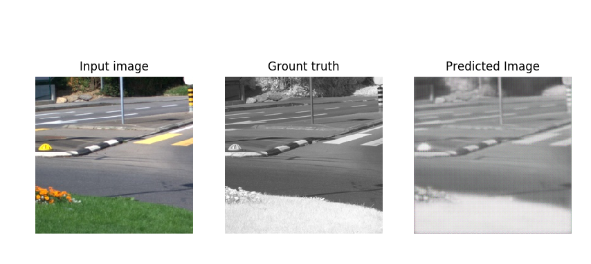

# pix2pix with tf.keras -->tf.enable_eager_execution()
Pix2pix model for decolorization RGB2NIR
This repo is a reimplementation of [iPython version](https://github.com/tensorflow/docs/blob/master/site/en/r2/tutorials/generative/pix2pix.ipynb) of pix2pix. In other words, is a copy with just a few modifications ;)

The images used for this task is from EPFL [RGBNIR dataset](https://ivrl.epfl.ch/research-2/research-downloads/supplementary_material-cvpr11-index-html/). 421 images were taken from the whole of dataset (90% for training and validation, and 10% for testing). The indoor scenes were not considered. They could be used for testing to :)
# How is it training

  

# Requeriments

* Python 3.7.3
* Tensorflow 1.13.1
* Matplotlib
* numpy

# Issues
* Memory ram leak in every interation, it restarts with new epoch.

